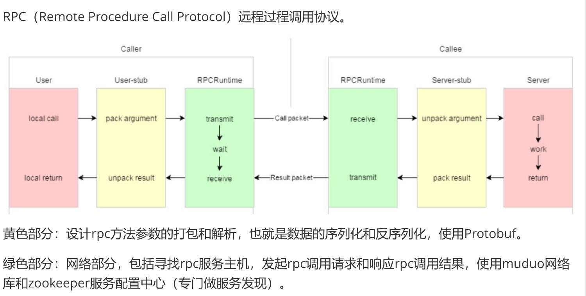

# 单机服务器的缺点
+ 受限于硬件资源, 服务器所能承载的并发量有限
+ 任意模块的修改都会导致整个项目代码重新编译和部署
+ 系统中有些模块是CPU密集型,有些是IO密集型的,造成各模块对硬件资源的需求是不一样的,无法针对性部署

# 集群
每台服务器都独立运行一个工程的所有模块
+ 优点
    - 用户的并发量提升了
+ 缺点
    - 项目代码还是需要整体重新编译,而且需要多次进行部署
    - 后台管理这样的模块不需要高并发,部署在一台服务器上即可但是却把这个模块部署在多台服务器上

# 分布式
一个工程拆分了很多模块,每一个模块独立部署运行在一个服务器主机上,所有服务器协同工作提供服务,每一台服务器称作分布式的一个节点,根据节点的并发要求,对一个节点可以再做节点模块集群部署

# RPC通信原理(Remote Processing Call远程过程调用)


# ProtoBuf
数据的序列化与反序列化
首先需要一个.proto文件
``` proto
syntax = "proto3"; //声明protobuf的版本

package fixbug;    //声明了代码所在的包,对于C++ 来说是namespace

message RCode {
    int32  errcode = 1;
    bytes errmsg  = 2;
}

//登陆消息类型
message LoginRequest {
    bytes name = 1; //第一个字段
    string pwd = 2; 
}

//登陆响应消息类型
message LoginResp {
    RCode result = 1;
    bool   success = 2;
}

// 
message GetFriendListReq {
    uint32 userid = 1;
} 

message User {
    bytes name = 1;
    int32 age  = 2;
    enum Gender {
        MAN = 0;
        WOMAN = 1;
    } 
    Gender gender = 3;
}

message GetFriendListResp {
    RCode result = 1;
    repeated User users = 2; //定义了一个列表类型
    
}
```
message LoginRequest 被编译为 class LoginRequest
继承自::google::protobuf::Message


在cpp中这样写:
``` cpp
#include "test.pb.h"
#include <iostream>
#include <string>

using namespace fixbug;

int main() {
    LoginRequest req;
    req.set_name("zhangsan");
    req.set_pwd("123456");
    std::string send_str;
    if (!req.SerializeToString(&send_str)) {
        std::cerr << "Failed to serialize LoginRequest." << std::endl;
        return -1;
    } else {
        std::cout << "Serialized LoginRequest: " << send_str << std::endl;
    }

    LoginRequest reqB;
    if (reqB.ParseFromString(send_str)) {
        std::cout << reqB.name() << "\n";
        std::cout << reqB.pwd() << "\n";
    }
    return 0;
}
```
编译proto
``` bash
protoc test.proto --cpp_out=./
```
编译main.cpp
``` bash
g++ main.cpp test.pb.cc -lprotobuf && ./a.out
```

列表
``` cpp
int main() {
    GetFriendListResp resp;
    RCode *code = resp.mutable_result();
    code->set_errcode(1);
    code->set_errmsg("hello");
    User *user1 = resp.add_users();
    user1->set_name("zhangsan");
    user1->set_gender(User::MAN);
    std::cout << resp.users_size() << "\n";
    User *user2 = resp.add_users();
    user2->set_name("lora");
    user2->set_gender(User::WOMAN);
    std::cout << resp.users_size() << "\n";
    const User &user3 = resp.users(1);
    std::cout << user3.age() << " " << user3.gender() << "\n";
    return 0;
}
```

# logger日志
不能采用锁, 因为如果读的时候为空,实际上是没有必要的

# Zookeeper
如果没有注册中心,客户端要访问一个rpc节点,必须知道其所在的url,所以要在本地存储一个url,但是如果服务器有变化,客户端必须手动修改.

为了解决上述情况,增加一个中间层--注册中心, 保存了能提供服务的名称,及url,首先这些服务会在注册中心进行注册,当客户端来查询,注册中心就会给出一个url.

__临时节点__: rpc节点超时未发送心跳消息, zk会自动删除临时性节点
__永久节点__: rpc节点超时未发送心跳, zk不会删除这个节点